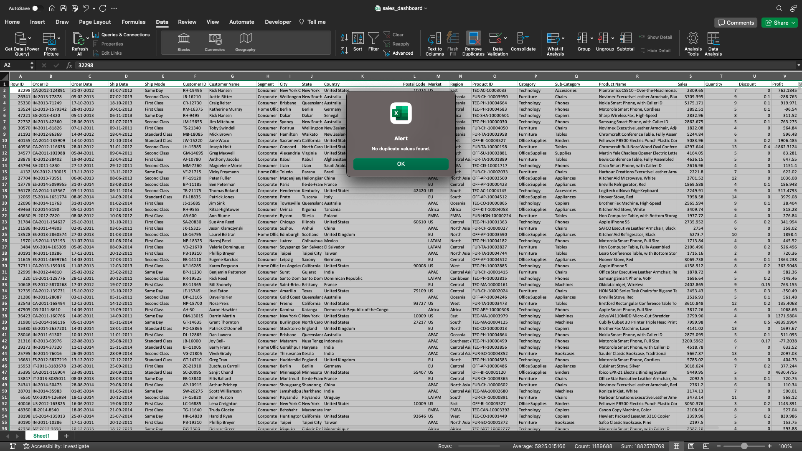
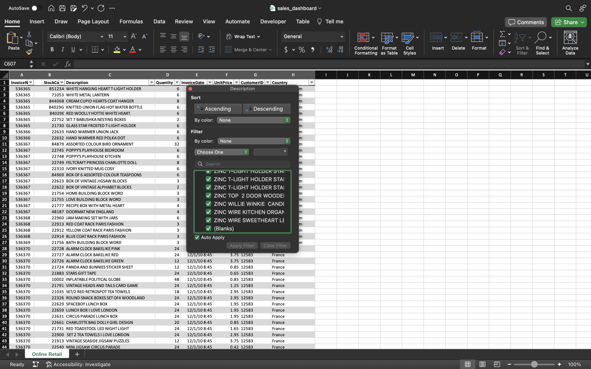

# Online Retail Sales Dashboard in Excel
## Project Overview 
The primary objective of this project is to conduct an exploratory analysis of the Global Superstore dataset, which comprises data on sales, customers, and shipping details from multiple countries. Our goal is to uncover insights, trends, and patterns that can assist in making informed business decisions. The findings will be showcased in an interactive dashboard, facilitating easy exploration and interpretation of the data.
## Data
The dataset in the `Global_Superstore2.xlsx` file contains a collection of 51,290 orders from a global superstore, covering a time frame from 01/01/2011 to 12/31/2014. Each row represents an individual order, and the dataset is comprised of both categorical and numerical columns. A brief description of each column is provided in the table below:

| Column Name    | Description                                             | Data Type      |
| -------------- | ------------------------------------------------------- | -------------- |
| Row ID         | Row identification number                               | Numeric        |
| Order ID       | Identification number of the order                      | Text           |
| Order Date     | Date when the order was placed                          | Text (Date)    |
| Ship Date      | Date when the order was shipped                         | Text (Date)    |
| Ship Mode      | Shipping method used for the order                      | Text           |
| Customer ID    | Identification number of the customer                   | Text           |
| Customer Name  | Name of the customer                                    | Text           |
| Segment        | Customer segment (e.g., Consumer, Corporate, etc.)      | Text           |
| City           | City where the order was placed                         | Text           |
| State          | State where the order was placed                        | Text           |
| Country        | Country where the order was placed                      | Text           |
| Postal Code    | Postal code of the delivery address (mainly U.S.)       | Numeric        |
| Market         | Market in which the order was made                      | Text           |
| Region         | Region where the order was placed                       | Text           |
| Product ID     | Identification number of the product                    | Text           |
| Category       | Category of the product                                 | Text           |
| Sub-Category   | Sub-category of the product                             | Text           |
| Product Name   | Name of the product                                     | Text           |
| Sales          | Sales amount for the order                              | Numeric        |
| Quantity       | Quantity of items ordered                               | Numeric        |
| Discount       | Discount applied to the order                           | Numeric        |
| Profit         | Profit made from the order                              | Numeric        |
| Shipping Cost  | Cost of shipping for the order                          | Numeric        |
| Order Priority | Priority of the order (e.g., Medium, High, etc.)        | Text           |

The data was sourced from Kaggle:
[Download the dataset](https://www.kaggle.com/datasets/apoorvaappz/global-super-store-dataset/data)
## Data Analytics Workflow

Our analytical journey will traverse through a well-defined process comprising of the following key steps:

`Data Check` → `Explore Data` → `Analyze & Visualize Data` → `Dashboarding` → `Communicate Insights`
### Data Check
The first step in the process involves checking for duplicates. To do this, highlight all the data, then navigate to the `Data` tab in the menu bar and select the `Remove Duplicates` option.

Upon initial examination, no duplicate values were identified. Next, we'll proceed to check for missing values. This can be done by formatting the data into a table and then clicking on each column filter to look for any `Blanks` entries.

We've identified missing values in the `Postal Code` column. Since we don't need the postal code for this analysis we will proceed to remove this column. 

