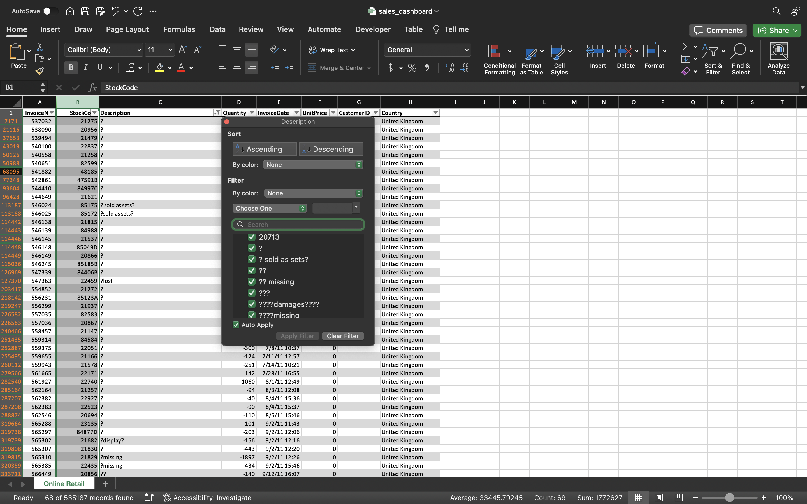

# Online Retail Sales Dashboard in Excel
## Project Overview 
This project aims to provide an in-depth analysis and visualization of an online retail sales dataset. The dataset includes transactions from December 1, 2010, to December 9, 2011, for a UK-based and registered non-store online retail company. Specializing in unique all-occasion gifts, the company's client base is predominantly wholesalers. A key part of this analysis involves creating an interactive dashboard to visualize key metrics and effectively communicate insights.
## Data

This dataset contains 541,909 instances.

| Variable Name | Type        | Description                                                                                   |
|---------------|-------------|-----------------------------------------------------------------------------------------------|
| InvoiceNo     | Categorical | A 6-digit integral number uniquely assigned to each transaction. 'c' indicates a cancellation. |
| StockCode     | Categorical | A 5-digit integral number uniquely assigned to each distinct product.                          |
| Description   | Categorical | Product name.                                                                                  |
| Quantity      | Integer     | The quantities of each product (item) per transaction.                                         |
| InvoiceDate   | Date        | The day and time when each transaction was generated.                                          |
| UnitPrice     | Continuous  | Product price per unit in sterling.                                                            |
| CustomerID    | Categorical | A 5-digit integral number uniquely assigned to each customer.                                  |
| Country       | Categorical | The name of the country where each customer resides.                                           |

Citation:  
[Online Retail. (2015). UCI Machine Learning Repository.](https://doi.org/10.24432/C5BW33)

## Data Analytics Workflow

Our analytical journey will traverse through a well-defined process comprising of the following key steps:

Data Check → Explore Data → Analyze and Visualize Data → Dashboarding → Communicate Insights
### Data Check
The first step in the process involves checking for duplicates. To do this, highlight all the data, then navigate to the "Data" tab in the menu bar and select the "Remove Duplicates" option.

Upon initial examination, 5,268 duplicate values were identified and removed, resulting in 536,641 unique entries. Next, we'll proceed to check for missing values. This can be done by formatting the data into a table and then clicking on each column filter to look for any 'Blanks' entries.

In our dataset, we've identified missing values in the 'Description' column. To remove these, we'll first uncheck the 'Select All' box, and then specifically check the box for 'Blanks.' After clicking 'OK,' we will see rows with missing values displayed. We'll select these rows and proceed to delete them.

After removing the missing values, 69 observations were identified in the description column that lacked a product name. These were subsequently removed, along with the missing values in the CustomerId column. After validating all the data, there were 148,222 observations remaining.

