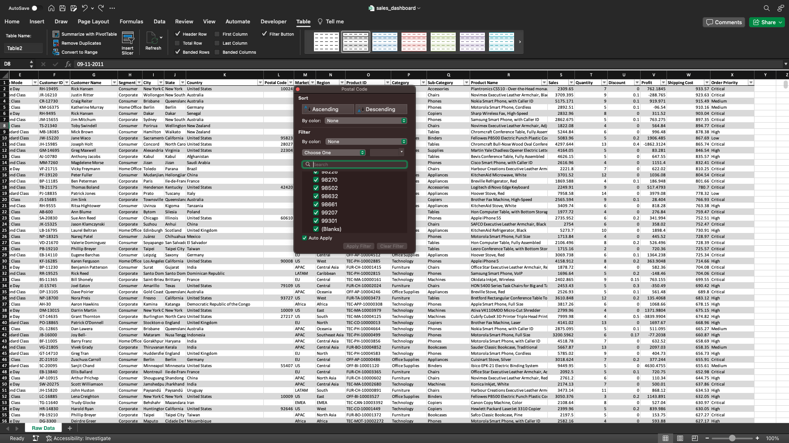

# Online Retail Sales Dashboard in Excel
## Project Overview 
This project aims to provide an in-depth analysis and visualization of an online retail sales dataset. The dataset includes transactions from December 1, 2010, to December 9, 2011, for a UK-based and registered non-store online retail company. Specializing in unique all-occasion gifts, the company's client base is predominantly wholesalers. A key part of this analysis involves creating an interactive dashboard to visualize key metrics and effectively communicate insights.
## Data

This dataset contains 541,909 observations.

| Variable Name | Type        | Description                                                                                   |
|---------------|-------------|-----------------------------------------------------------------------------------------------|
| InvoiceNo     | Categorical | A 6-digit integral number uniquely assigned to each transaction. 'c' indicates a cancellation. |
| StockCode     | Categorical | A 5-digit integral number uniquely assigned to each distinct product.                          |
| Description   | Categorical | Product name.                                                                                  |
| Quantity      | Integer     | The quantities of each product (item) per transaction.                                         |
| InvoiceDate   | Date        | The day and time when each transaction was generated.                                          |
| UnitPrice     | Continuous  | Product price per unit in sterling.                                                            |
| CustomerID    | Categorical | A 5-digit integral number uniquely assigned to each customer.                                  |
| Country       | Categorical | The name of the country where each customer resides.                                           |

Citation:  
[Online Retail. (2015). UCI Machine Learning Repository.](https://doi.org/10.24432/C5BW33)

## Data Analytics Workflow

Our analytical journey will traverse through a well-defined process comprising of the following key steps:

`Data Check` → `Explore Data` → `Analyze & Visualize Data` → `Dashboarding` → `Communicate Insights`
### Data Check
The first step in the process involves checking for duplicates. To do this, highlight all the data, then navigate to the `Data` tab in the menu bar and select the `Remove Duplicates` option.

Upon initial examination, 5,268 duplicate values were identified and removed, resulting in 536,641 observations. Next, we'll proceed to check for missing values. This can be done by formatting the data into a table and then clicking on each column filter to look for any `Blanks` entries.

In our dataset, missing values have been identified within the `Description` and `CustomerID` columns. To eliminate these, we will first deselect the `Select All` option and then specifically select the checkbox for `Blanks`. Upon clicking `OK`, rows containing missing values will be displayed. We will then select and delete these rows. Following this deletion, 401,605 observations remain in the dataset.

## Explore Data
The subsequent step in the workflow involves summarizing the data through exploratory analysis. We begin by applying conditional formatting to the dataset to visually distinguish between positive and negative quantities. To accomplish this, highlight all the values in the `Quantity` column and navigate to the `Home` ribbon to click on the `Conditional Formatting` button. From there, select `New Rule`.

We will establish two separate rules for this purpose. For the first rule, under `Style`, choose `Classic`, then select `Format only cells that contain`. In the ensuing dialog, set `Cell Value` to `greater than or equal to` and enter `1` as the value. For the format, opt for a `Green Fill with Dark Green Text`.

Repeat this process for negative quantities. However, change the criterion from `greater than or equal to` to `less than` and set the value to `0`. The format for these cells should be a `Light Red Fill with Dark Red Text`.

Now let's create a new worksheet title `Explore Data` and calculate some key metrics. 