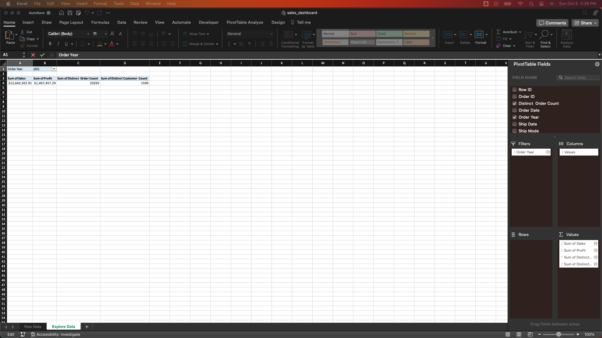
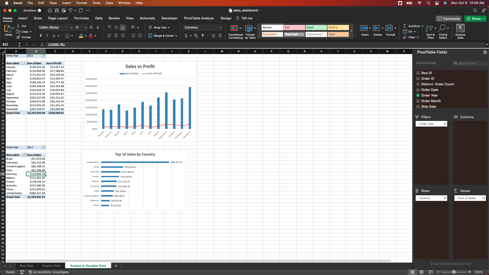
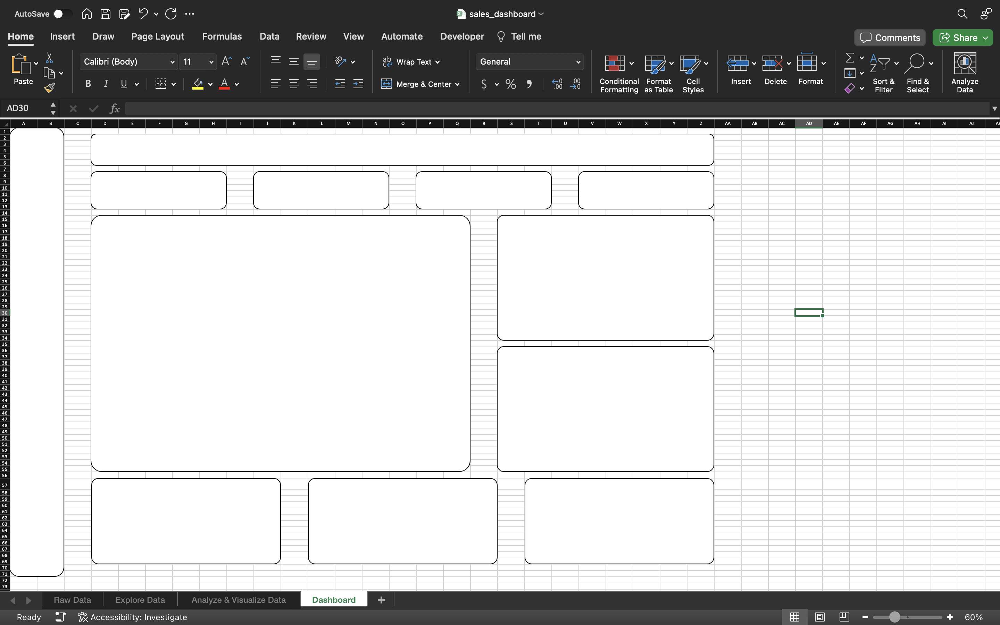

# Global Superstore Sales Dashboard in Excel

## Project Overview 
The primary objective of this project is to conduct an exploratory analysis of the Global Superstore dataset, which comprises data on sales, customers, and shipping details from multiple countries. Our goal is to uncover insights, trends, and patterns that can assist in making informed business decisions. The findings will be showcased in an interactive dashboard, facilitating easy exploration and interpretation of the data.
## Data
The dataset in the `Global_Superstore2.xlsx` file contains a collection of 51,290 orders from a global superstore, covering a time frame from 01/01/2011 to 12/31/2014. Each row represents an individual order, and the dataset is comprised of both categorical and numerical columns. A brief description of each column is provided in the table below:

| Column Name    | Description                                             | Data Type      |
| -------------- | ------------------------------------------------------- | -------------- |
| Row ID         | Row identification number                               | Numeric        |
| Order ID       | Identification number of the order                      | Text           |
| Order Date     | Date when the order was placed                          | Date           |
| Ship Date      | Date when the order was shipped                         | Date           |
| Ship Mode      | Shipping method used for the order                      | Text           |
| Customer ID    | Identification number of the customer                   | Text           |
| Customer Name  | Name of the customer                                    | Text           |
| Segment        | Customer segment (e.g., Consumer, Corporate, etc.)      | Text           |
| City           | City where the order was placed                         | Text           |
| State          | State where the order was placed                        | Text           |
| Country        | Country where the order was placed                      | Text           |
| Postal Code    | Postal code of the delivery address (mainly U.S.)       | Numeric        |
| Market         | Market in which the order was made                      | Text           |
| Region         | Region where the order was placed                       | Text           |
| Product ID     | Identification number of the product                    | Text           |
| Category       | Category of the product                                 | Text           |
| Sub-Category   | Sub-category of the product                             | Text           |
| Product Name   | Name of the product                                     | Text           |
| Sales          | Sales amount for the order                              | Numeric        |
| Quantity       | Quantity of items ordered                               | Numeric        |
| Discount       | Discount applied to the order                           | Numeric        |
| Profit         | Profit made from the order                              | Numeric        |
| Shipping Cost  | Cost of shipping for the order                          | Numeric        |
| Order Priority | Priority of the order (e.g., Medium, High, etc.)        | Text           |

The data was sourced from Kaggle:
[Download the dataset](https://www.kaggle.com/datasets/apoorvaappz/global-super-store-dataset/data)
## Data Analytics Workflow

Our analytical journey will traverse through a well-defined process comprising of the following key steps:

`Data Check` → `Explore Data` → `Analyze & Visualize Data` → `Dashboarding` → `Communicate Insights`
### Data Check
Begin by converting the `Order Date` and `Ship Date` columns to the `Date` data type. To do this, select both columns and choose `Date` from the dropdown menu in the `Home` ribbon. 


Next, lets check for duplicates. To do this, highlight all the data, then navigate to the `Data` tab in the menu bar and select the `Remove Duplicates` option.


Upon initial examination, no duplicate values were identified. Next, we'll proceed to check for missing values. This can be done by formatting the data into a table and then clicking on each column filter to look for any `Blanks` entries.


We've identified missing values in the `Postal Code` column. Since we don't need the postal code for this analysis we will proceed to remove this column. 
### Explore Data
The next step in our workflow is to conduct an exploratory data analysis to summarize the data and determine key performance indicators. Begin by creating a new worksheet named `Explore Data`. Given that we're using Excel for Mac, it's essential to set up a `Distinct Customer Count` column and a `Distinct Order Count` column to get a unique count of all customers and orders when creating a pivot table, which will serve as a key performance indicators (KPIs). To do this, add a new column named `Distinct Customer Count` to the `Raw Data` worksheet and apply the following formula:
```excel
=IF(COUNTIF($G$2:G2,G2)>1,0,1)
```
Do the same for `Distinct Order Count`:
```excel
=IF(COUNTIF($B$2:B2,B2)>1,0,1)
```


By summing the values in these column within the pivot table, we can determine the unique count of customers and orders. Next, let's add an `Order Year` column adjacent to the `Order Date` column. This will allow us to filter our pivot table by year. We can extract the year from the `Order Date` column using this formula:
```excel
=YEAR([@[Order Date]])
```


Next, navigate to the `Raw Data` worksheet, select all of its contents, go to the `Insert` tab, and choose the `PivotTable` option. Ensure you place the pivot table in the newly created worksheet.


In the `Values` section of the PivotTable, drag the columns `Sales`, `Profit`, `Distinct Customer Count`, and `Distinct Order Count`. Place the `Order Year` in the `Filters` section.  Format the sums of both Sales and Profit as `Currency`. Meanwhile, ensure the sums of Customer Count and Order Count are formatted as `Numbers`, rounded to the nearest whole number.



### Analyze & Visualize Data
The next step in the workflow entails selecting appropriate visualizations to effectively convey a message and conduct a more advanced analysis. Initially, create a new worksheet and title it `Analyze & Visualize Data`. Following this, navigate to the `Raw Data` worksheet, highlight all the data, then proceed to the `Insert` tab. Click on `PivotChart` and add it to the `Analyze & Visualize Data` worksheet.


Now, drag the `Sales` and `Profit` columns to the `Values` section. Move the `Order Month` column to the `Axis` section and the `Order Year` column to the `Filters` section. Format the Sum of Sales and Sum of Profit to the `Currency` data type, and alter the chart to a combination of a bar and line graph, referred to as a combo chart.


Next, let's create a PivotChart depicting the top ten sales figures by country, filtered by year. First, navigate back to the `Raw Data` worksheet and highlight the data. Then, click on `PivotChart` and add the Pivotchart to the `Analyze & Visualize Data` worksheet. Drag the `Sales` field to the `Values` section, the `Country` field to the `Rows` section, and the `Order Year` field to the `Filters` section. Once the Pivotchart is created, right-click on the countries, navigate to `Filter`, and select to filter for the top 10 sales. Sort the sales figures from largest to smallest. 

 

Now, let's repeat the same process for profit.


Next, we will create three pivot tables: one for the top 10 selling products (by total sales amount), another for the top 10 selling products (by total sales volume), and a third for the top 10 customers. To accomplish this, navigate to the `Raw Data` worksheet and highlight all the data. Select `PivotTable` and add it to the `Analyze & Visualize Data` worksheet. Drag the `Sales` column to the `Values` field and the `Product Name` column to the `Rows` field. Right-click on the `Product Name` in the table, filter for the top 10 products, and sort them from largest to smallest.


Repeat the process for identifying the top 10 selling products by total sales volume, but this time, drag the `Quantity` column to the `Values` field instead. 


For the top 10 customers, repeat the process but place the `Customer Name` column in the `Rows` field and the `Sales` column in the `Values` field.


### Dashboarding
Now, we move on to creating the dashboard and consolidating all the visualizations we have crafted. First, let's start by creating a new worksheet titled `Dashboard` and draw border boxes to strategize the layout of our dashboard.


Next, we will place a rounded rectangle inside each border box and fill it with the color white.



Then, proceed to eliminate the grid lines, set the background color to `Blue, Accent 1, Lighter 80%`, and change the fill color of the left card to `Blue, Accent 1, Darker 25%`.


Now, let's add a title to the dashboard and incorporate a logo. Additionally, we should assign titles to the cards that will display our KPIs and pivot tables.


Next, we will insert text boxes within the cards to display KPIs and pivot tables. We will utilize cell references to populate the dashboard with the relevant data. Change the format of the data to be consistent with the rest of the dashboard.


Next, copy the three Pivot charts we've created and paste them into the dashboard, ensuring they are formatted to match the dashboard's existing style.


For the final step, add two slicers to the dashboard: one for the year and another for the segment. To do this, navigate to the `Explore Data` worksheet and click on the pivot table. Then, proceed to the `PivotTable Analyze` section and select `Insert Slicer`. Create slicers for `Order Year` and `Segment`. Next, right-click on each slicer, go to `Report Connections`, and establish a connection to each pivot table in the dashboard. Finally, copy the slicers and paste them into the dashboard.


After some formatting adjustments, we have now achieved the final product.


## Communicate Insights
Now for the most important step in the whole process: communicating the insights to stakeholders. The following key insights have been discerned from the dashboard, which helps in answering pivotal business questions:

1. **Sales Trends**: There has been a notable upward trend in sales across all segments, with an average growth rate of 24% annually. This consistent rise indicates a healthy expansion in the company's market reach and product acceptance.

2. **Customer Growth**: The customer base has been expanding at an average annual rate of 28%, suggesting effective marketing strategies and a growing brand presence.

3. **Profitability**: Profits have been increasing at an average annual rate of 26%, reflective of robust business operations and effective cost management.

4. **Segment Performance**: The Consumer division emerges as the most significant contributor to sales, amassing a total of $6,507,949 over the assessed four-year period. This segment should continue to receive targeted investment to maintain and enhance its market-leading position.

5. **Top Customers**: In identifying the top customers within each division - Greg Tran in the Consumer division ($35,550.95), Tamra Chan in the Corporate division ($37,457.33), and Tom Ashbrook in the Home Office division ($40,488.07) - we highlight the value of nurturing these relationships to ensure continued loyalty and business.

6. **Leading Products by Sales**: The Apple Smart Phone, Full Size, has generated the highest sales, with a total of $86,935.78. This product's success can offer insights into consumer preferences and inform inventory and marketing strategies.

7. **Leading Products by Volume**: Staples, with a sales volume of 876 units, lead in quantity sold. The high turnover of this item suggests it is a staple good with consistent demand, and stocking such items can ensure steady revenue streams.

The dashboard serves as a comprehensive tool that not only tracks performance metrics across multiple dimensions but also informs strategic decision-making. It is an indispensable resource for understanding the nuances of the business trajectory, identifying strengths to build upon, and revealing opportunities for improvement.

### Recommendations for Business Growth and Customer Loyalty:
1. **Segment-Specific Strategies**: Considering the significant sales in the Consumer division, strategies should be tailored to maintain dominance in this segment while exploring untapped potential in the Corporate and Home Office divisions.

2. **Product Focus**: The popularity of the Apple Smart Phone suggests a focus on technology and related products could be advantageous. Bundling products and creating cross-selling opportunities with accessories may further boost sales.

3. **Customer Relationship Management (CRM)**: The identification of top customers in each segment underscores the importance of a personalized CRM approach to retain key clients and enhance loyalty.

4. **Inventory Management**: The high volume of staple items like Staples suggests the need for an efficient inventory management system to avoid stockouts and maximize turnover.

5. **Market Analysis**: Ongoing market analysis can identify emerging trends, enabling the business to stay ahead of the curve and adjust inventory and marketing efforts accordingly.

6. **Customer Feedback**: Actively seeking and analyzing customer feedback can reveal areas for improvement in product offerings and customer service, encouraging repeat business and referrals.

In conclusion, the dashboard reveals a thriving business environment with ample opportunities for further growth. Strategic focus on high-performing segments, coupled with informed product selection and dedicated CRM, will aid in amplifying sales, profits, and customer loyalty.